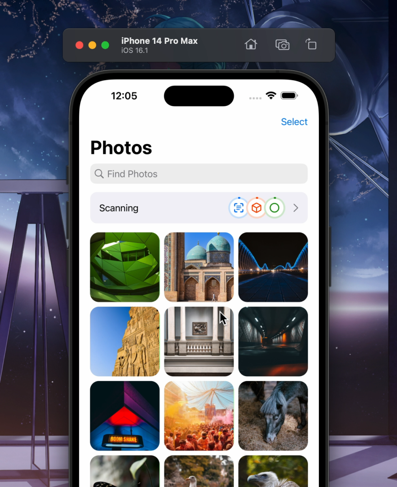
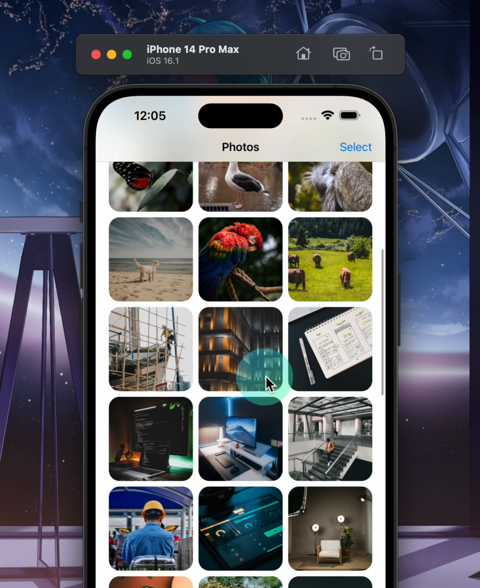

# Squirrel

🐿️ *Pronounced: Scroll-Wheel*

A menu bar app that adds scrolling to the simulator.

- For some reason, you can't scroll in Xcode's simulator.
- This app enables scrolling again!
- Features: customizable settings, made with SwiftUI, and a cute squirrel.

## Installation

You can download Squirrel on the [App Store](https://apps.apple.com/app/squirrel-for-simulator/id1669664068) here.

Alternatively, get the [Zip file](https://github.com/aheze/Squirrel/blob/main/Squirrel.zip), or use Homebrew:

```bash
brew tap hkamran80/things
brew install hkamran80/things/squirrel
```

**Note:** Squirrel requires macOS Big Sur (11.0) or higher.

## Screenshots

<table>

<tr>
<td>
Main Menu
</td>
<td>
Advanced Settings
</td>
</tr>

<tr>
</tr>
  
<tr>
<td>

</td>
<td rowspan=5>

</td>
</tr>

<tr>
</tr>
  
<tr>
<td>
Dark Mode
</td>
</tr>
  
<tr>
</tr>

  
<tr>
<td>

</td>
</tr>
 
</table>

<table>
<tr>
<td>
1. You start scrolling
</td>
<td>
2. Squirrel drags on the screen for you
</td>
<td>
3. Your cursor auto-snaps back to where you started
</td>
</tr>
  
  
<tr>
</tr>  
  
<tr>
<td>

</td>
<td>

</td>
<td>

</td>
</tr>
</table>

## Videos

https://user-images.githubusercontent.com/49819455/216271894-3e2352a4-edd0-41b7-a830-1cc4fb9aa15e.mp4

https://user-images.githubusercontent.com/49819455/216271984-b6672a5f-72ad-40bd-b01b-dad7059d92ae.mp4

## Notes

- Press <kbd>ESC</kbd> to stop scrolling, in case something bugs out.
- Trackpad support is currently unstable. Most scroll wheels should work.
- Customization Reference - General:
  - `Enabled` - whether Squirrel is active.
  - `Natural Scrolling` - toggles the scroll direction.
  - `Pointer Color` - the color of the cursor pointer.
  - `Pointer Size` - the length of the pointer.
  - `Pointer Opacity` - the opacity.
  - `Pointer Scale` - scale the pointer by this when scrolling starts.
- Customization Reference - Advanced:
  - `Launch Simulator on Startup` - launch the Simulator when Squirrel starts.
  - `Quit If Simulator Is Closed` - auto-quit the app when the Simulator isn't active.
  - `Scroll Steps` - how many interations to get to the final scroll value.
  - `Inactivity Timeouyt` - how many seconds to wait before stopping scroll.
  - `Scroll Interval` - how often to execute a scroll step.
  - `Top Inset` - top insets to cancel out simulator bezels. Only allow scrolling when the cursor falls inside the inset frame.
  - `Left Inset` - same as above for the left side.
  - `Right Inset` - same as above for the right side.
  - `Bottom Inset` - same as above for the bottom side.
  - `Simulator Location` - the file path of the simulator, for `Launch Simulator on Startup`
  - `Simulator Check Frequency` - how often to check if the simulator is alive, for `Quit If Simulator Is Closed`
  - `Max Height` - the maximum height of the menu popover.
  - `Menu Width` - the width of the menu popover.

## Community

Author | Contributing | Need Help?
--- | --- | ---
Squirrel is made by [aheze](https://github.com/aheze). | All contributions are welcome. Just [fork](https://github.com/aheze/Squirrel/fork) the repo, then make a pull request. | Open an [issue](https://github.com/aheze/Squirrel/issues) or join the [Discord server](https://discord.com/invite/Pmq8fYcus2). You can also ping me on [Twitter](https://twitter.com/aheze0). Or read the source code — there's lots of comments.

### How does it work?

Squirrel uses your Mac's accessibility controls to simulate a "drag" gesture.

### Apple, if you're reading this:

Please add native scroll support to the Simulator! Feels like such a small feature but it'll be very welcome.

## License

```text
MIT License

Copyright (c) 2023 A. Zheng

Permission is hereby granted, free of charge, to any person obtaining a copy
of this software and associated documentation files (the "Software"), to deal
in the Software without restriction, including without limitation the rights
to use, copy, modify, merge, publish, distribute, sublicense, and/or sell
copies of the Software, and to permit persons to whom the Software is
furnished to do so, subject to the following conditions:

The above copyright notice and this permission notice shall be included in all
copies or substantial portions of the Software.

THE SOFTWARE IS PROVIDED "AS IS", WITHOUT WARRANTY OF ANY KIND, EXPRESS OR
IMPLIED, INCLUDING BUT NOT LIMITED TO THE WARRANTIES OF MERCHANTABILITY,
FITNESS FOR A PARTICULAR PURPOSE AND NONINFRINGEMENT. IN NO EVENT SHALL THE
AUTHORS OR COPYRIGHT HOLDERS BE LIABLE FOR ANY CLAIM, DAMAGES OR OTHER
LIABILITY, WHETHER IN AN ACTION OF CONTRACT, TORT OR OTHERWISE, ARISING FROM,
OUT OF OR IN CONNECTION WITH THE SOFTWARE OR THE USE OR OTHER DEALINGS IN THE
SOFTWARE.
```
